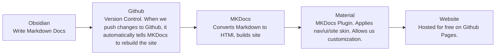

## Pipeline Explanation 



!!! info inline end "Quick Reference"
	* [Material for MKDocs Guide](https://squidfunk.github.io/mkdocs-material/reference/diagrams/) explains fun formatting options
	* [[Markdown Copy-paste Tools]] has several ready to copy-paste formatting blocks from the Material guide.
	* [Markdown formatting cheat-sheet](https://www.craftmarkdown.com/markdown-cheat-sheet)
	
	```
	.\.venv\Scripts\Activate.ps1
	```
	
	```
	mkdocs serve
	```
	

=== "Pipeline Overview"
	#### Pipeline Overview
	Obsidian is a note-taking app for working with Markdown files. Markdown files act like text files and can be edited outside of Obsidian. They are tiny, and the ones you work with in Obsidian are stored locally on your computer, giving you total ownership over them. 
	
	We are using Github to share and sync our Obsidian project. When we push changes to Github, it runs our bare-bones Markdown files through website generation program MkDocs, and refreshes our website with new content. 
	
=== "Why Obsidian"
	#### Why Obsidian?
	1. **Obsidian is free**
		* Most other collaborative Wiki programs Paywall collaboration and document sharing. 
	2. **Markdown is straightforward to use.**
		*  Markdown wascreated in 2004 as an easier way to write HTML.
		* Prevents overthinking formatting and styling documentation.
		* Styling is done automatically by our MKDocs skin.
	3. **Markdown files are portable.**
		* We don't need to worry about changing payment plans. 
		* We can reuse our markdown files for future projects. 


***

## Getting Connected

1. **Install prerequisite programs:**
	1. [Download Obsidian](https://obsidian.md/download) (for free!) 
	2. [Download Github Desktop](https://desktop.github.com/download/) (for free!)
	3.  [Create Github Account](https://github.com/) (if lacking one)
2. **Clone the repository to your computer.**
	1. [Access our Repository on Github](https://github.com/l4valamp/safetravels-docs)
	2. Click the green **Code Dropdown**, **Open with Github Desktop**.
	3. When Github Desktop opens, it should prompt you where you'd like to store your repository. Choose a location and hit **Clone**. 
	4. Once it is finished downloading, you are able to access it in Obsidian.
	5. **To push your work, you may need to ask Greta for a collaborator invitation on Github. You will need to send your Github username, and accept the collaboration invitation when the email goes out to you.**
	   
	![[Pasted image 20260726023118.png]]
	
4. **Open the Repository in Obsidian**
	1. Open Obsidian.
	2. Click **Open Folder as Vault**.
	3. Go to the folder you cloned with Github Desktop and select the **Docs** sub-folder. Then click open.
	   
	
	![[Pasted image 20260726024517.png]]

??? warning "Opening the Right Vault Folder"

	 
	!!! quote  ""
		 You will know that you are in the correct folder **"docs"** if you can see all of the wiki folders on your sidebar. If you see the **"docs"** parent folder instead, you're too far out. To open **"docs"** instead, click the bottom of your sidebar that displays your current vault, and go to **"Manage Vaults"**. Here, you can open a new folder. 
	
	![[Pasted image 20260729035341.png|283]]
	![[Pasted image 20260729035250.png]]
	
		 
***
## Updating Documentation

!!! Danger "Important Warnings to Read First and Remember Always"
	**We cannot Check out Files with Github and Obsidian like we can with Unreal and Perforce**. <br/>
	
	Before writing documentation, Always remember to open Github Desktop and **Fetch Origin**, then **Pull Origin**. This is the equivalent of refreshing and getting latest from Perforce. 
	
	**Communicate with the team if you work on pre-existing pages others might also be writing in.** Becaues Markdown is such a simple format, it will be straightforward to retrieve overwritten material and copy-paste it back in, but that's only if the work was pushed to main. **Push your work often.**
	
	**Commiting a file to main is not the same as pushing. Remember to always click "Push to Main" after working.**

#### Standards and Practices
* If you paste in an image drag the image into the Assets folder on the left. 
* Try to keep all image file sizes smallish or host images on Imgur.	


***

### Previewing the Website live (OPTIONAL)

If you want to view changes to the website as you're writing, MKDocs allows users to preview changes before they're published. 
#### Set-up
1. [Install Python](https://www.python.org/downloads/) 
	1. Enable Add Python to PATH during installation
	2. Type Y, Y when prompted
2. **Open your local Repository (Safetravels-docs)** 
	1. Easy access through Github Desktop -> Repository -> Show in Explorer.
3. **Hold shift-C and right click in the folder.**
	1. On Windows, click the option that says **Open Powershell Window Here**. 
4. **Create the virtual environment**
	1. You will only need to do this step once. 

First, paste the line below. This guarantees you have permission to run scripts on your system. 
```
Set-ExecutionPolicy -Scope CurrentUser RemoteSigned
```

Then, paste this line below. This downloads local versions of the Mkdocs packages and plugins that generate the website. It will take a minute to load. 
```
pip install -r requirements.txt
```

**The following two steps are the ones you will repeat to open the live updates in the future.** You should be able to enter into your virtual environment by pasting the line below. You will know it has succeeded if you see a green (venv.) at the start of the next console lines
```
.\.venv\Scripts\Activate.ps1
```

Once you see the green (venv.) paste the line below. That should have given you a link like: Serving on http://127.0.0.1:8000/safetravels-docs/. Copy-paste this into the browser. This serves as a live-updating preview of the website.
   ```
   mkdocs serve
   ```
 
 When you're finished, click into the code window and hit CTRL + C to stop the updating. 
