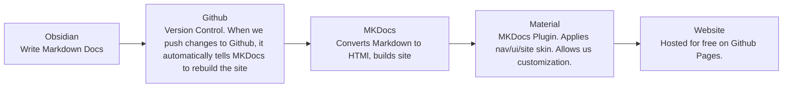

## Pipeline Explanation 

#### Pipeline Overview
Obsidian is a note-taking app for working with Markdown files. Markdown files act like text files and can be edited outside of Obsidian. They are tiny, and the ones you work with in Obsidian are stored locally on your computer, giving you total ownership over them. 

We are using Github to share and sync our Obsidian project. When we push changes to Github, it sends our bare-bones Markdown files to a program called MKDocs that converts the Markdown to HTML and builds a website. A second program called Material for MKDocs then adds extra styling. Finally, Github Pages updates our site and the change is live.



With this pipeline, our writing and styling are being handled by completely separate entities. This lets us make easy global changes to our page styling, and keeps our documentation independent from its platform in case we want to move things around or reuse it in the future.

Team members interested in writing documentation will need to connect to our repo through Github to open the wiki in Obsidian and make changes. (Technically, one could just edit the Markdown files on the Github website in an emergency, but Obsidian is a much nicer environment to work in.)

#### Why Obsidian?
1. Obsidian is free!
	* Most other collaborative Wiki programs (Notion, Confluence, Wordpress, Clickup, etc.) Paywall collaboration and document sharing. 
	* Even if it wasn't free, Obsidian still has serious advantages over other platforms. 
2. Markdown is straightforward to use.
	*  Markdown is a writing format created in 2004 as an easier way to write HTML.
	* Markdown prevents overthinking formatting and styling documentation.
	* Documentation styling is done automatically by our MKDocs skin.
3. Markdown files are portable.
	* Markdown files can be converted into HTML and keep their formatting across platforms/vendors. Other vendors use bespoke formatting we could not easily transfer. 


***

## Getting Started

1. Install prerequisite programs:
	1. [Download Obsidian](https://obsidian.md/download) (for free!) 
	2. [Download Github Desktop](https://desktop.github.com/download/) (for free!)
	3.  [Create Github Account](https://github.com/) (if lacking one)
2. Clone the repository to your computer. 
	1. [Access our Repository on Github](https://github.com/l4valamp/safetravels-docs)
	2. Click the green **Code Dropdown**, **Open with Github Desktop**.
	3. When Github Desktop opens, it should prompt you where you'd like to store your repository. Choose a location and hit **Clone**. 
	4. Once it is finished downloading, you are able to access it in Obsidian.
![[Pasted image 20260726023118.png]]
3. Open the Repository in Obsidian
	1. Open Obsidian.
	2. Click **Open Folder as Vault**.
	3. Go to the folder you cloned with Github Desktop and select the **Docs** sub-folder. Then click open.
![[Pasted image 20260726024517.png]]

***
## Updating Documentation

!!! Danger "Important Warnings to Read First and Remember Always"
	**We cannot Check out Files with Github and Obsidian like we can with Unreal and Perforce**. <br/>
	
	Before writing documentation, Always remember to open Github Desktop and **Fetch Origin**, then **Pull Origin**. This is the equivalent of refreshing and getting latest from Perforce. 
	
	**Communicate with the team if you work on pre-existing pages others might also be writing in.** Becaues Markdown is such a simple format, it will be straightforward to retrieve overwritten material and copy-paste it back in, but that's only if the work was pushed to main. **Push your work often.**
	
	**Commiting a file to main is not the same as pushing. Remember to always click "Push to Main" after working.**

#### Helpful Resources
* [Material for MKDocs Guide](https://squidfunk.github.io/mkdocs-material/reference/diagrams/) explains fun formatting options
* [[Markdown Copy-paste Tools]] has several ready to copy-paste formatting blocks from the Material guide.
* [Markdown formatting cheat-sheet](https://www.craftmarkdown.com/markdown-cheat-sheet)

#### Standards and Practices
* If you paste in an image drag the image into the Assets folder on the left. 
* Try to keep all image file sizes smallish or host images on Imgur.	

!!! warning "This page is a work in progress"
	This page will be updated with new standards and practices we discover what works.

#### Previewing the Website live (OPTIONAL)

If you want to view changes to the website as you're writing, MKDocs allows users to preview changes before they're published. 

1. [Install Python](https://www.python.org/downloads/) 
	1. Enable **Add Python to PATH** during installation
	2. Type Y, Y when prompted
2. Open your local Repository clone that contains the Obsidian files: **Safetravels-docs** 
3. Hold shift and right click. On Windows, click the option that says **Open Powershell Window Here**. 
4. Create the virtual environment
5. May receive an error that running scripts is disabled on this system
```
Set-ExecutionPolicy -Scope CurrentUser RemoteSigned
```
7. Paste: 
```
pip install -r requirements.txt
```
8. Paste:
   ```
   .\.venv\Scripts\Activate.ps1
   ```
   9. Paste:
   ```
   mkdocs serve
   ```
   10. That should have given you a link like: Serving on http://127.0.0.1:8000/safetravels-docs/. Copy-paste this into the browser. 
   11. When you're finished, click into the code window and hit CTRL + C to stop the updating. 
   12. hiiii


**Bold**
### Header
* List
* Thing
	* Like this 
	* skjdslkfsajd
[[UI Documentation]] jshdfkjhads

```
Code Blocks
```